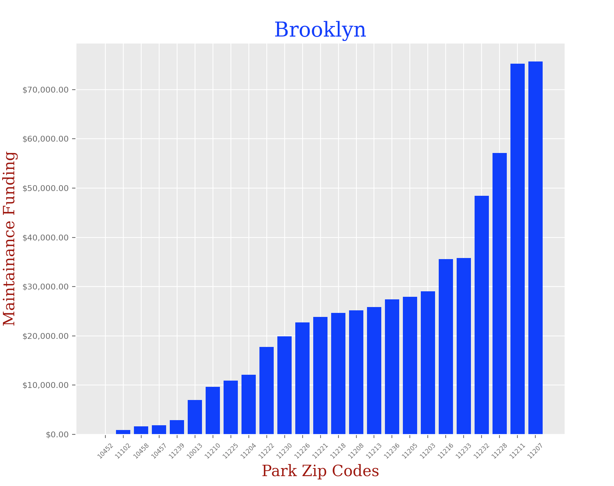
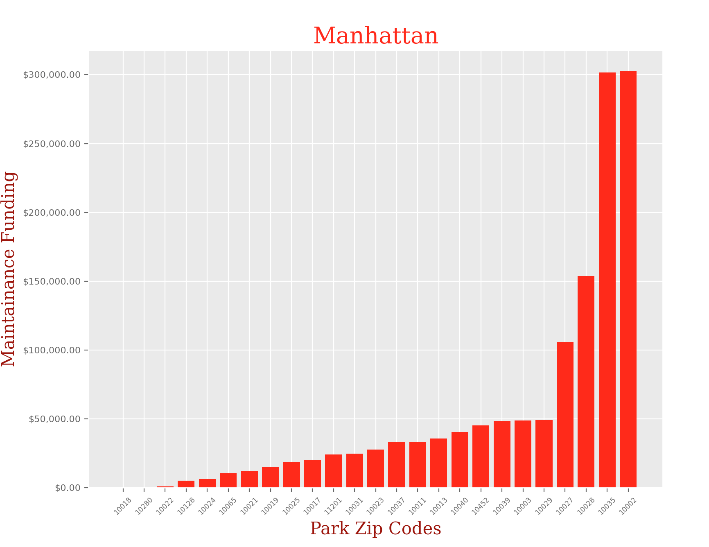
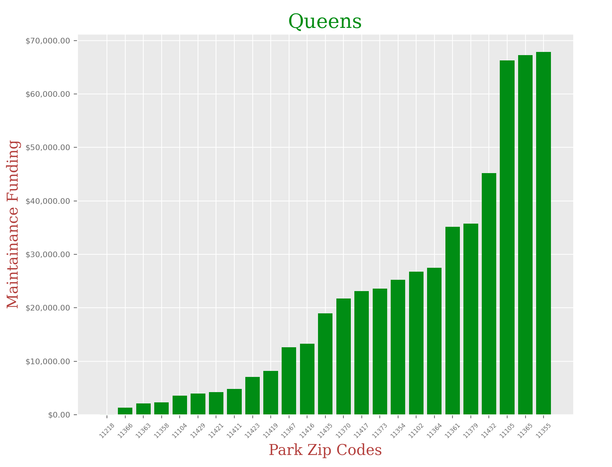
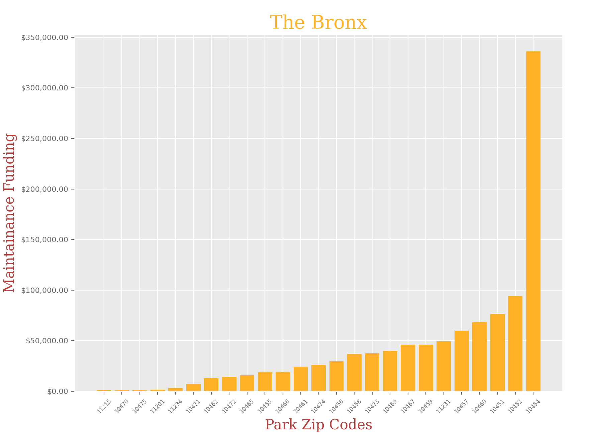
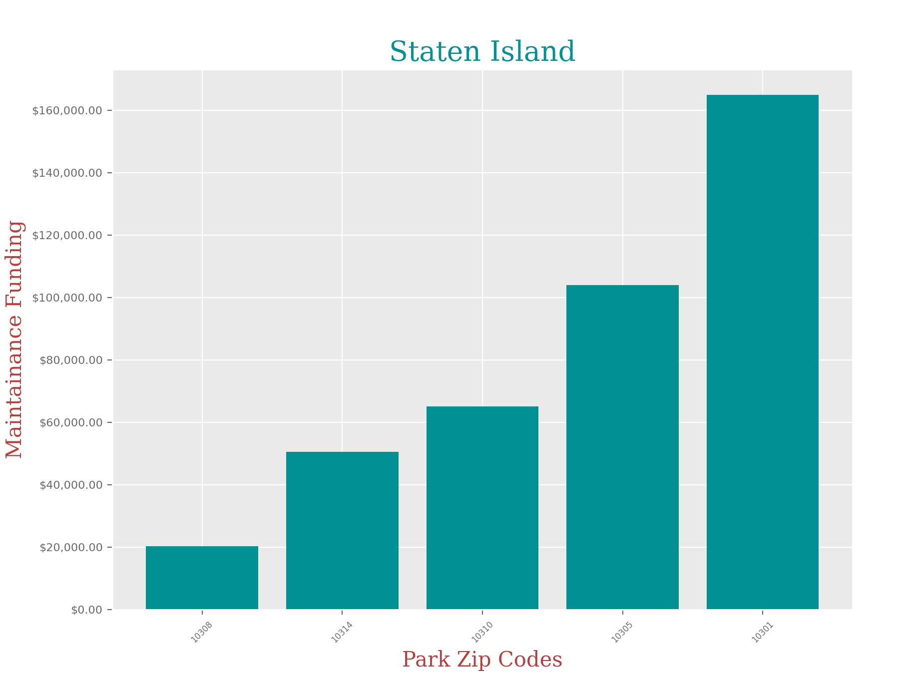

## NYC Park Maintenance

### What is the project about?

We want to test how much funding NYC parks receives maintenance depending on what borough they are in and what zipcode they are in within that borough.

### What is this significant?

Parks are so valuable and enrich the lives of so many New Yorkers. There’s nothing like being in a beautiful park that is very well taken care of. It is important to solve this problem because there are parks in New York that are not properly taken care of and they are so important to our mental health to be in a nice, peaceful, and clean environment. From kids to adults, everyone needs nice quality parks accessible to them, no matter where in New York City they live.

### Links:
- [Open NYC Data for Park Maintainance (2020)](https://www.nycgovparks.org/news/archive)
- [Open NYC Data for Park Properties](https://data.cityofnewyork.us/Recreation/Parks-Properties/enfh-gkve)

### Import Libraries:
```markdown
import pandas as pd
import matplotlib.pyplot as plt
```
### User Inputs:
```markdown
#Get input and output file names:
df1 = pd.read_csv('parksProperties.csv')
df2 = pd.read_csv('nycParkFunding2020.csv')
outFile = 'samG_project.csv'
```
### Making a Function convertMoney():
```markdown
#We want to get to the sum of quarterly funding for NYC parks, 
#so we have to converts the strings into floats.
def convertMoney(col):
    df[col] = df[col].apply(lambda x: x.replace('$','')) #striping dollar sign
    df[col] = df[col].apply(lambda x: x.replace(',','')) #striping comma
    df[col] = df[col].astype(float) #converting to float
    return df
```
### Organizing the data:
```markdown
#For the 1st Dataframe
df1 = df1[['ACQUISITIONDATE','LOCATION','Sign Name','ZIPCODE']].dropna()
df1['ACQUISITIONDATE'] = df1['ACQUISITIONDATE'].apply(lambda x: x.replace(' 00:00:00.0000000','')) #striping the string of zeros
df1 = df1[(df1["Sign Name"] != 'Park') & (df1["Sign Name"] != 'Prospect Park')]
```
```markdown
#For the 2nd Dataframe
df2 = df2[['Sign Name','Borough Code','Sector Desc.','Q1WorkOrderCost',
'Q2WorkOrderCost','Q3WorkOrderCost','Q4WorkOrderCost']].dropna()
df2 = df2[df2["Sign Name"] != 'Park']
df2 = convertMoney('Q1WorkOrderCost')
df2 = convertMoney('Q2WorkOrderCost')
df2 = convertMoney('Q3WorkOrderCost')
df2 = convertMoney('Q4WorkOrderCost')
df2['Total Spending'] = (df2['Q1WorkOrderCost'] + df2['Q2WorkOrderCost']
 + df2['Q3WorkOrderCost'] + df2['Q4WorkOrderCost'])
```
```markdown
#Combining them into one dataframe to analyze
df = pd.merge(df1, df2)
```
Now, we are organizing the data from the orginal csv that we pulled to use for our purposes. Notice that now we have a column 'Total Spending' so we can easily see which parks are recieving adequate funding for maintainence.
```markdown
#Individual borough dataframes
man_df = df.loc[(df['Borough Code'] == 'M') & (df['ZIPCODE'].str.len() <= 5), :]
bronx_df = df.loc[(df['Borough Code'] == 'X') & (df['ZIPCODE'].str.len() <= 5), :]
queens_df = df.loc[(df['Borough Code'] == 'Q') & (df['ZIPCODE'].str.len() <= 5), :]
bk_df = df.loc[(df['Borough Code'] == 'B') & (df['ZIPCODE'].str.len() <= 5), :]
staten_df = df.loc[(df['Borough Code'] == 'R') & (df['ZIPCODE'].str.len() <= 5), :]
```
```markdown
plt.style.use('ggplot')
```
### Brooklyn:
```markdown
bk_df = bk_df.groupby('ZIPCODE').sum().sample(25).reset_index()
bk_df.sort_values('Total Spending', ascending = True, inplace= True)

x = bk_df['ZIPCODE']
y = bk_df['Total Spending']
x_pos = [i for i, _ in enumerate(x)]
fig, ax = plt.subplots(figsize=(8,7))

plt.bar(x_pos, y, color='blue')
font1 = {'family':'serif','color':'blue','size':20}
font2 = {'family':'serif','color':'darkred','size':15}
plt.title("Brooklyn", fontdict = font1)
plt.xlabel("Park Zip Codes",fontdict = font2)
plt.ylabel("Maintainance Funding", fontdict = font2)
plt.xticks(x_pos, x)
plt.xticks(rotation=45)
# change the fontsize
ax.set_xticklabels(x, fontsize=6)
ax.set_yticklabels(y, fontsize=8)
ax.yaxis.set_major_formatter("${x:,.2f}")
plt.show()
```

### Manhattan:
```markdown
man_df = man_df.groupby('ZIPCODE').sum().sample(25).reset_index()
man_df.sort_values('Total Spending', ascending = True, inplace= True)

x = man_df['ZIPCODE']
y = man_df['Total Spending']
x_pos = [i for i, _ in enumerate(x)]
fig, ax = plt.subplots(figsize=(8,7))

plt.bar(x_pos, y, color='red')
font1 = {'family':'serif','color':'red','size':20}
font2 = {'family':'serif','color':'darkred','size':15}
plt.title("Manhattan", fontdict = font1)
plt.xlabel("Park Zip Codes",fontdict = font2)
plt.ylabel("Maintainance Funding", fontdict = font2)
plt.xticks(x_pos, x)
plt.xticks(rotation=45)
# change the fontsize
ax.set_xticklabels(x, fontsize=6)
ax.set_yticklabels(y, fontsize=8)
ax.yaxis.set_major_formatter("${x:,.2f}")
plt.show()
```

### Queens:
```markdown
queens_df = queens_df.groupby('ZIPCODE').sum().sample(25).reset_index()
queens_df.sort_values('Total Spending', ascending = True, inplace= True)

x = queens_df['ZIPCODE']
y = queens_df['Total Spending']
x_pos = [i for i, _ in enumerate(x)]
fig, ax = plt.subplots(figsize=(8,7))

plt.bar(x_pos, y, color='green')
font1 = {'family':'serif','color':'green','size':20}
font2 = {'family':'serif','color':'brown','size':15}
plt.title("Queens", fontdict = font1)
plt.xlabel("Park Zip Codes",fontdict = font2)
plt.ylabel("Maintainance Funding", fontdict = font2)
plt.xticks(x_pos, x)
plt.xticks(rotation=45)
# change the fontsize
ax.set_xticklabels(x, fontsize=6)
ax.set_yticklabels(y, fontsize=8)
ax.yaxis.set_major_formatter("${x:,.2f}")
plt.show()
```

### The Bronx:
```markdown
bronx_df = bronx_df.groupby('ZIPCODE').sum().sample(25).reset_index()
bronx_df.sort_values('Total Spending', ascending = True, inplace= True)

x = bronx_df['ZIPCODE']
y = bronx_df['Total Spending']
x_pos = [i for i, _ in enumerate(x)]
fig, ax = plt.subplots(figsize=(8,7))

plt.bar(x_pos, y, color='orange')
font1 = {'family':'serif','color':'orange','size':20}
font2 = {'family':'serif','color':'brown','size':15}
plt.title("The Bronx", fontdict = font1)
plt.xlabel("Park Zip Codes",fontdict = font2)
plt.ylabel("Maintainance Funding", fontdict = font2)
plt.xticks(x_pos, x)
plt.xticks(rotation=45)
# change the fontsize
ax.set_xticklabels(x, fontsize=6)
ax.set_yticklabels(y, fontsize=8)
ax.yaxis.set_major_formatter("${x:,.2f}")
plt.show()
```

### Staten Island:
```markdown
staten_df = staten_df.groupby('ZIPCODE').sum().sample(5).reset_index()
staten_df.sort_values('Total Spending', ascending = True, inplace= True)

x = staten_df['ZIPCODE']
y = staten_df['Total Spending']
x_pos = [i for i, _ in enumerate(x)]
fig, ax = plt.subplots(figsize=(8,7))

plt.bar(x_pos, y, color='teal')
font1 = {'family':'serif','color':'teal','size':20}
font2 = {'family':'serif','color':'brown','size':15}
plt.title("Staten Island", fontdict = font1)
plt.xlabel("Park Zip Codes",fontdict = font2)
plt.ylabel("Maintainance Funding", fontdict = font2)
plt.xticks(x_pos, x)
plt.xticks(rotation=45)
# change the fontsize
ax.set_xticklabels(x, fontsize=6)
ax.set_yticklabels(y, fontsize=8)
ax.yaxis.set_major_formatter("${x:,.2f}")
plt.show()
```


### Discoveries:
It is clear that there is a huge disparity in funding that each park in NYC receives depending on their zip code, and borough. I didn’t think the difference would be so significant, but when you look at the charts, you can clearly see that some of these parks in certain zip codes are in serious need of funding.

### Conclusion:
It has become very apparent since Covid-19 that people’s mental health relies heavily on community, going outside, and finding somewhere where they feel safe and unfortunately, there are some parks that are not receiving as much attention in other zip codes. If we can fix this problem, we can improve the mental health of thousands of New Yorkers.


